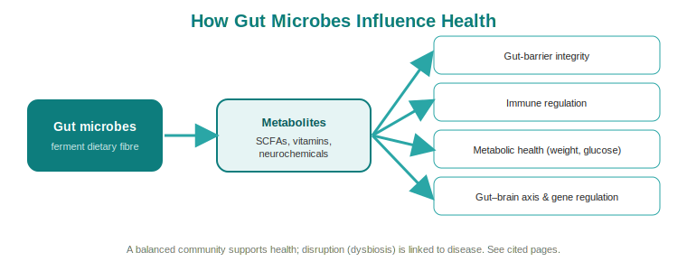

# Why the Microbiome Matters

!!! info "Page status"
    **Level:** Beginner &nbsp;·&nbsp; **Status:** :material-circle: Drafted &nbsp;·&nbsp; **Last reviewed:** 2026-06-14

> **Purpose:** Explain, in plain terms, why the microbiome is central to human health — and why the science is moving from "interesting correlation" to "actionable cause."

## In one sentence

The gut microbiome shapes how we digest food, defend against illness, and even how the brain works — so keeping it balanced is increasingly seen as central to whole-body health.

## Key points

- The microbiome helps run **metabolism**, and imbalances are linked to obesity, type 2 diabetes, fatty liver, and cardio-metabolic disease.[^fan2020]
- It connects to the brain through the **gut-brain axis**, and dysbiosis is associated with neurological conditions.[^sorboni2022]
- It supports the **immune system** and keeps the **gut barrier** intact.[^rinninella2019]
- Microbes produce **metabolites** — such as short-chain fatty acids — that influence the brain and behaviour.[^caspani2019]
- The field is shifting from simply describing the microbiome to proving **cause and effect**.[^fan2020]

## The detail

The simplest reason the microbiome matters: these microbes do real work for us. They help break down food and extract nutrients, keep the lining of the gut (the mucosal barrier) intact, help train and regulate the immune system, and crowd out harmful pathogens.[^rinninella2019] When the community falls out of balance — a state called **dysbiosis** — those protective functions weaken, and the effects are not limited to the gut.[^rinninella2019]

**Metabolism.** The gut microbiota is closely tied to how the body handles energy. Disruptions have been implicated in obesity, type 2 diabetes, non-alcoholic (fatty) liver disease, and broader cardio-metabolic disease.[^fan2020] For example, a higher abundance of *Akkermansia* is associated with a lower risk of metabolic syndrome in a dose-dependent way.[^akkermansia2021] And in early childhood, functional features of the gut microbiome — including genes for short-chain fatty acid biosynthesis — associate with protection from type 1 diabetes.[^t1d2018] Deep-metagenome cohorts linked to extensive health data have likewise surfaced many microbiome associations with disease and medication use.[^gutmeta2022] This is why microbiome science has drawn so much attention from researchers working on metabolic health.

**The brain.** There is a two-way communication channel between the gut and the brain, often called the **microbiota-gut-brain axis**. Dysbiosis has been linked to a range of neurological disorders through this axis.[^sorboni2022] One mechanism: gut microbes produce small molecules called **metabolites** — including short-chain fatty acids — that can influence brain function and behaviour.[^caspani2019]

**The immune system and barrier.** A balanced community helps regulate immunity and maintains the integrity of the gut barrier, which keeps the right things in and the wrong things out.[^rinninella2019]

**Aging.** Microbiome health also tracks with how well we age: frailty is negatively associated with the diversity of the gut microbiota, so lower diversity tends to accompany greater frailty.[^frailty2016]

| Body system | What the microbiome does | What imbalance is linked to |
|-------------|--------------------------|-----------------------------|
| Metabolic | Helps regulate energy handling | Obesity, type 2 diabetes, fatty liver, cardio-metabolic disease[^fan2020] |
| Nervous (gut-brain) | Two-way signalling; metabolite production | Neurological disorders[^sorboni2022][^caspani2019] |
| Immune / barrier | Trains immunity, protects gut lining | Weakened defence against pathogens[^rinninella2019] |

!!! tip "So what?"
    A healthy microbiome is not just about avoiding an upset stomach. Because it touches metabolism, immunity, and even the brain, supporting it is increasingly framed as supporting whole-body health — and measuring it gives a person a clearer picture of where they stand.[^rinninella2019][^fan2020]

Crucially, the science is maturing. The field is moving beyond *describing* which microbes are present toward establishing **cause and effect** using multi-omics approaches.[^fan2020] That shift is what turns the microbiome from a research curiosity into a basis for real-world decisions.

## Why it matters for Dayhoff / DHealth

This is the "why should I care" page for every customer and clinician conversation. The breadth of impact — metabolic, neurological, immune — is our core value story: the microbiome is not a niche concern but a lever on whole-body health. And because the research is moving toward cause-and-effect,[^fan2020] we can position measurement today as a forward-looking, scientifically grounded step rather than a fad.

## Common questions

**"Is microbiome health really linked to anything beyond digestion?"**
Yes. It is associated with metabolic conditions like obesity and type 2 diabetes,[^fan2020] with metabolic syndrome (e.g. *Akkermansia* abundance),[^akkermansia2021] with type 1 diabetes,[^t1d2018] with neurological conditions via the gut-brain axis,[^sorboni2022] with frailty and aging,[^frailty2016] and with immune regulation and gut barrier integrity.[^rinninella2019] Large cohorts linking deep metagenomes to health data have catalogued many such associations.[^gutmeta2022]

**"Is this just correlation, or does the microbiome actually cause disease?"**
The honest answer: the field is actively moving from correlation toward cause-and-effect using multi-omics methods.[^fan2020] That maturing evidence base is exactly why measurement is becoming more valuable.

**"How can gut microbes possibly affect the brain?"**
Through the microbiota-gut-brain axis. Gut microbes produce metabolites such as short-chain fatty acids that can influence brain function and behaviour.[^caspani2019]

---

### References

[^fan2020]: Fan Y, Pedersen O. *Gut microbiota in human metabolic health and disease*. Nat Rev Microbiol. 2021;19(1):55-71. [DOI](https://doi.org/10.1038/s41579-020-0433-9)
[^sorboni2022]: Sorboni SG, Moghaddam HS, Jafarzadeh-Esfehani R, Soleimanpour S. *A Comprehensive Review on the Role of the Gut Microbiome in Human Neurological Disorders*. Clin Microbiol Rev. 2022;35(1):e0033820. [DOI](https://doi.org/10.1128/CMR.00338-20)
[^rinninella2019]: Rinninella E, Raoul P, Cintoni M, et al. *What is the Healthy Gut Microbiota Composition? A Changing Ecosystem across Age, Environment, Diet, and Diseases*. Microorganisms. 2019;7(1):14. [DOI](https://doi.org/10.3390/microorganisms7010014)
[^caspani2019]: Caspani G, Kennedy S, Foster JA, Swann J. *Gut microbial metabolites in depression: understanding the biochemical mechanisms*. Microb Cell. 2019;6(10):454-481. [DOI](https://doi.org/10.15698/mic2019.10.693)
[^gutmeta2022]: Aasmets O, Krigul KL, Lüll K, Metspalu A, Org E. *Gut metagenome associations with extensive digital health data in a volunteer-based Estonian microbiome cohort*. Nat Commun. 2022;13(1):869. [DOI](https://doi.org/10.1038/s41467-022-28464-9)
[^t1d2018]: Vatanen T, Franzosa EA, Schwager R, et al. *The human gut microbiome in early-onset type 1 diabetes from the TEDDY study*. Nature. 2018;562(7728):589-594. [DOI](https://doi.org/10.1038/s41586-018-0620-2)
[^akkermansia2021]: Zhou Q, Pang G, Zhang Z, et al. *Association between gut Akkermansia and metabolic syndrome is dose-dependent and affected by microbial interactions*. Diabetes Metab Syndr Obes. 2021;14:2177-2188. [DOI](https://doi.org/10.2147/DMSO.S311388)
[^frailty2016]: Jackson MA, Jeffery IB, Beaumont M, et al. *Signatures of early frailty in the gut microbiota*. Genome Med. 2016;8(1):8. [DOI](https://doi.org/10.1186/s13073-016-0262-7)
