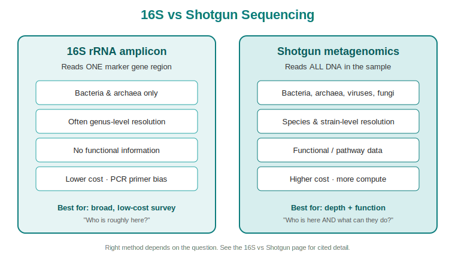

# 16S vs Shotgun: Choosing a Method

!!! info "Page status"
    **Level:** Intermediate &nbsp;·&nbsp; **Status:** :material-circle: Drafted &nbsp;·&nbsp; **Last reviewed:** 2026-06-14

> **Purpose:** The core decision page for sales and clients — what the two main microbiome sequencing methods are, how they differ, and why it matters for health.

---

## In one sentence

**16S sequencing reads one "barcode" gene to tell you *which bacteria* are roughly present and is cheap and robust; shotgun sequencing reads *all* the DNA in a sample to tell you *which species and strains* are there **and** *what they can do*, at higher cost.**[^quince2017][^johnson2019]

!!! tip "So what? (the 30-second version for a customer)"
    If a client only needs a broad "who's here at the genus level" snapshot, 16S is economical and proven. If they need **species/strain-level identity**, **functional insight** (what the microbes actually *do* — metabolism, antibiotic-resistance genes), or coverage of **non-bacterial** members (viruses, fungi, archaea), shotgun is the stronger tool.[^quince2017][^johnson2019][^laudadio2018] The right answer depends on the clinical or commercial question — not on which method is "best" in the abstract.

---

## What each method actually does

### 16S rRNA amplicon sequencing
The 16S ribosomal RNA gene is present in essentially all bacteria and archaea and contains regions that are conserved (shared across organisms) interspersed with **hypervariable regions** that differ between groups. 16S sequencing uses PCR primers to **amplify and read one or a few of those variable regions**, then matches the sequences to a reference database to assign taxonomy.[^johnson2019] Because it targets a single gene, it is relatively inexpensive, tolerant of low-biomass and host-contaminated samples, and well established.[^knight2018]

**The catch:** short-read sequencing of individual variable regions **cannot achieve the taxonomic resolution of the full-length gene**, so 16S often resolves organisms only to the genus level and struggles at species and strain level.[^johnson2019] The PCR amplification step can also introduce **bias** — some organisms amplify more efficiently than others, skewing the apparent community composition.[^ziesemer2015]

### Shotgun metagenomic sequencing
Shotgun sequencing skips the targeted-PCR step and instead **fragments and sequences all of the DNA in a sample** — bacteria, archaea, viruses, and single-celled eukaryotes alike.[^quince2017] Because it reads whole genomes rather than one marker gene, it can characterise organisms at **species and strain level** and, critically, can profile the **functional potential** of the community: the metabolic pathways, virulence factors, and antibiotic-resistance genes the microbes carry.[^quince2017] In direct head-to-head comparisons on the same human stool samples, shotgun sequencing identified a **larger number of species per sample** than 16S amplicon sequencing.[^laudadio2018]

**The catch:** shotgun generates far more data per sample, costs more, is more computationally demanding, and is more sensitive to host-DNA contamination and to organisms that have no close match in reference databases.[^quince2017]

---

## Side-by-side comparison

| Dimension | 16S rRNA amplicon | Shotgun metagenomics |
|---|---|---|
| **What's sequenced** | One/few variable regions of the 16S gene[^johnson2019] | All DNA in the sample[^quince2017] |
| **Organisms detected** | Bacteria & archaea | Bacteria, archaea, viruses, fungi/eukaryotes[^quince2017] |
| **Typical taxonomic resolution** | Often genus level; limited at species/strain[^johnson2019] | Species and strain level achievable[^quince2017][^johnson2019] |
| **Functional information** | No (taxonomy only — what's there, not what it does) | Yes — pathways, resistance & virulence genes[^quince2017] |
| **Known biases** | PCR primer / amplification bias[^ziesemer2015] | Host-DNA contamination; database gaps[^quince2017] |
| **Relative cost & data load** | Lower | Higher[^quince2017] |
| **Good fit when** | Broad community survey, low budget, low-biomass samples[^knight2018] | Need species/strain ID, function, or non-bacterial members[^quince2017] |

!!! note "So what? Why the functional difference is the big one"
    Two people can host the *same species* of gut bacteria yet carry **different strains with different genes** — one benign, one capable of producing a harmful metabolite or resisting an antibiotic. 16S taxonomy generally can't tell those apart; shotgun's whole-genome, function-level view can.[^quince2017][^johnson2019] For any question where *what the microbes do* matters — not just *who they are* — that is the decisive advantage.

---

## Why this matters for health

The microbiome isn't an academic curiosity — its composition and function are tied to human health. According to PubMed-indexed reviews, the gut microbiota is implicated in **metabolic health and disease**, including obesity, type 2 diabetes, non-alcoholic liver disease, and cardio-metabolic disease,[^fan2020] and a growing literature links it to **neurological and neuropsychiatric conditions** through the gut–brain axis.[^sorboni2022]

The field is explicitly moving **from descriptive "who is there" census studies toward cause-and-effect, mechanism-level questions** — which depend on the kind of functional, multi-omics data that shotgun metagenomics provides.[^fan2020][^knight2018]

!!! tip "So what? The health takeaway for sales conversations"
    Clients increasingly want to know not just *whether* a microbe is present but *what it is doing* and *whether that links to a health outcome*. The science is heading toward function and mechanism,[^fan2020] which is exactly where deeper sequencing earns its cost. Framing our offering around the **clinical question** — metabolic, neurological, infection-related — lands better than a feature list.

---

## How this compares to *other* testing that exists today

Microbiome NGS is not the only way to look at microbes. The most common alternatives, and where sequencing pulls ahead:

- **Culture (growing microbes in the lab).** The classic method, but **many microbes are difficult or impossible to culture**, which causes labs to miss community members and misjudge how communities function.[^quince2017] Because nearly all pathogens contain DNA or RNA, **untargeted sequencing can detect organisms that conventional, culture-based diagnostics miss**, which is precisely why clinical metagenomic next-generation sequencing is being adopted in areas where standard approaches have limitations.[^gu2019]
- **Targeted PCR / qPCR panels.** Fast and sensitive, but they only find the **specific organisms you design the test to look for** — you have to know what you're hunting for in advance. Untargeted shotgun metagenomics is **hypothesis-free**: it can flag unexpected organisms without a pre-specified target.[^gu2019]
- **16S amplicon vs shotgun (within NGS).** Covered above — both are sequencing, but shotgun adds species/strain resolution and function that 16S generally cannot reach.[^johnson2019][^quince2017]

!!! warning "Stay honest — what shotgun is *not*"
    Deeper is not automatically "better" for every job. Shotgun costs more, is computationally heavier, and can be confounded by host DNA and by organisms missing from reference databases.[^quince2017] For a broad, budget-constrained community survey, 16S remains a sound, well-validated choice.[^knight2018] The credible sales position is **"right method for the question,"** not "ours beats everything."

---

## Common questions (objection handling)

**"Isn't 16S good enough? It's cheaper."**
For a genus-level community survey on a budget, often yes.[^knight2018] But if the client needs species/strain identity or functional insight (metabolism, resistance genes), 16S generally can't deliver it and shotgun can.[^johnson2019][^quince2017]

**"Why does strain-level resolution matter?"**
Because strains of the same species can differ functionally — in the genes they carry and the metabolites or resistance they produce. Whole-genome shotgun data can distinguish them where single-gene 16S taxonomy often cannot.[^quince2017][^johnson2019]

**"How is this better than a culture or a PCR panel?"**
Culture misses hard-to-grow organisms; targeted PCR only finds what it's designed to find. Untargeted sequencing is hypothesis-free and can detect organisms those methods miss.[^quince2017][^gu2019]

---

### References

This page cites peer-reviewed literature indexed in **PubMed**. Full entries live in the [master reference list](../resources/references.md).

[^quince2017]: Quince C, Walker AW, Simpson JT, Loman NJ, Segata N. *Shotgun metagenomics, from sampling to analysis*. Nat Biotechnol. 2017;35(9):833-844. [DOI](https://doi.org/10.1038/nbt.3935)
[^johnson2019]: Johnson JS, Spakowicz DJ, Hong BY, et al. *Evaluation of 16S rRNA gene sequencing for species and strain-level microbiome analysis*. Nat Commun. 2019;10(1):5029. [DOI](https://doi.org/10.1038/s41467-019-13036-1)
[^laudadio2018]: Laudadio I, Fulci V, Palone F, Stronati L, Cucchiara S, Carissimi C. *Quantitative Assessment of Shotgun Metagenomics and 16S rDNA Amplicon Sequencing in the Study of Human Gut Microbiome*. OMICS. 2018;22(4):248-254. [DOI](https://doi.org/10.1089/omi.2018.0013)
[^ziesemer2015]: Ziesemer KA, Mann AE, Sankaranarayanan K, et al. *Intrinsic challenges in ancient microbiome reconstruction using 16S rRNA gene amplification*. Sci Rep. 2015;5:16498. [DOI](https://doi.org/10.1038/srep16498)
[^knight2018]: Knight R, Vrbanac A, Taylor BC, et al. *Best practices for analysing microbiomes*. Nat Rev Microbiol. 2018;16(7):410-422. [DOI](https://doi.org/10.1038/s41579-018-0029-9)
[^fan2020]: Fan Y, Pedersen O. *Gut microbiota in human metabolic health and disease*. Nat Rev Microbiol. 2021;19(1):55-71. [DOI](https://doi.org/10.1038/s41579-020-0433-9)
[^sorboni2022]: Sorboni SG, Moghaddam HS, Jafarzadeh-Esfehani R, Soleimanpour S. *A Comprehensive Review on the Role of the Gut Microbiome in Human Neurological Disorders*. Clin Microbiol Rev. 2022;35(1):e0033820. [DOI](https://doi.org/10.1128/CMR.00338-20)
[^gu2019]: Gu W, Miller S, Chiu CY. *Clinical Metagenomic Next-Generation Sequencing for Pathogen Detection*. Annu Rev Pathol. 2019;14:319-338. [DOI](https://doi.org/10.1146/annurev-pathmechdis-012418-012751)
