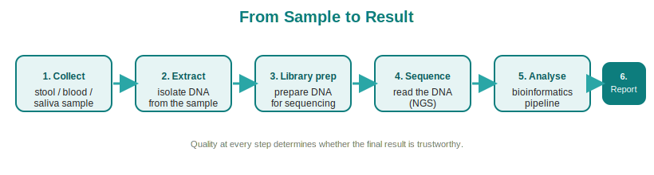

# From Sample to Result: The Workflow

!!! info "Page status"
    **Level:** Intermediate &nbsp;·&nbsp; **Status:** :material-circle: Drafted &nbsp;·&nbsp; **Last reviewed:** 2026-06-14

> **Purpose:** Walk through the end-to-end journey — collection, extraction, library prep, sequencing, analysis, report — so the team can confidently explain what happens to a customer's sample.

## In one sentence

A sample travels through six stages — collection, DNA extraction, library preparation, sequencing, bioinformatics analysis, and reporting — turning a physical specimen into a clear, interpretable result.

## Key points

- **Six stages:** collect → extract → library prep → sequence → analyze → report.
- **Sample collection** quality sets a ceiling on everything downstream; good experimental design matters from the start.[^knight2018]
- **DNA extraction and library prep** convert the specimen into sequencer-ready material.
- **Sequencing** reads the genetic material at high throughput.[^goodwin2016]
- **Bioinformatics** turns raw reads into named organisms and functions, and is where reproducibility is won or lost.[^knight2018] [^quince2017]

## The detail

**1. Sample collection.** Everything starts with the specimen — stool, swab, or other material. How it's collected, stored, and transported directly affects result quality, so thoughtful experimental design and consistent handling are foundational, not afterthoughts.[^knight2018]

**2. DNA extraction.** The lab breaks open cells and isolates their DNA (and, for some assays, RNA) from the rest of the sample. The goal is clean, representative genetic material; extraction method can influence which organisms are well represented, which is why standardization matters.

**3. Library preparation.** The extracted DNA is converted into a "library" — fragments tagged with adapters so the sequencer can read them. For shotgun metagenomics this means preparing essentially all the DNA from sampling through to analysis as a single workflow.[^quince2017] For amplicon methods, this is also where the targeted region is amplified.

**4. Sequencing.** The prepared library is loaded onto a sequencer, which reads the genetic letters at massive scale. This high-throughput reading is exactly what next-generation sequencing made affordable and routine.[^goodwin2016]

**5. Bioinformatics and analysis.** The sequencer outputs raw reads — millions of short strings of letters that mean nothing on their own. Bioinformatics turns them into answers: cleaning the data, then assigning reads to organisms and functions. Profiling can be **assembly-based** (stitching reads into longer genome fragments) or **mapping-based** (matching reads to references).[^quince2017] Going beyond taxonomy to microbial **function** is where meta-omics approaches — combining metagenomics with metatranscriptomics and metabolomics — add the most value.[^metaomics2019] This is also where modern practice favors exact sequence variants (ASVs) over older OTU clustering, and where reproducible methods are critical.[^knight2018]

**6. Reporting.** Finally, analytical output is translated into a clear, interpretable result for the customer or clinician — the deliverable that the whole pipeline exists to produce.

| Stage | What happens | What it produces |
| --- | --- | --- |
| 1. Collection | Specimen gathered and stored | Raw sample |
| 2. Extraction | Cells lysed, DNA/RNA isolated | Purified genetic material |
| 3. Library prep | DNA fragmented and adapter-tagged | Sequencer-ready library |
| 4. Sequencing | Genetic letters read at scale[^goodwin2016] | Raw sequence reads |
| 5. Bioinformatics | Reads cleaned, classified, profiled[^quince2017] | Organisms + functions |
| 6. Reporting | Results interpreted and packaged | Customer-ready report |

!!! tip "So what?"
    Quality compounds across the pipeline: a poorly collected sample or an inconsistent extraction can't be rescued by great sequencing. Standardized handling and reproducible bioinformatics are what make results trustworthy and comparable — the difference between data and a dependable answer.[^knight2018]

## Why it matters for Dayhoff / DHealth

Customers want to know what happens to their sample and why they can trust the result. Being able to narrate all six stages — and to point out that rigor at collection and analysis is where quality is won — builds credibility. It also helps the team handle turnaround-time and quality questions with specifics instead of hand-waving.

## Common questions

**Q: What's the single biggest factor in result quality?**
There's no one factor, but it starts at collection: good experimental design and handling set the ceiling for everything downstream.[^knight2018]

**Q: Why does analysis take compute, not just sequencing?**
Raw reads are meaningless until bioinformatics cleans and classifies them into organisms and functions.[^quince2017]

**Q: What made this whole workflow practical?**
High-throughput, low-cost next-generation sequencing turned reading genetic material at scale into a routine step.[^goodwin2016]

### References

[^quince2017]: Quince C, Walker AW, Simpson JT, Loman NJ, Segata N. *Shotgun metagenomics, from sampling to analysis*. Nat Biotechnol. 2017;35(9):833-844. [DOI](https://doi.org/10.1038/nbt.3935)
[^knight2018]: Knight R, Vrbanac A, Taylor BC, et al. *Best practices for analysing microbiomes*. Nat Rev Microbiol. 2018;16(7):410-422. [DOI](https://doi.org/10.1038/s41579-018-0029-9)
[^goodwin2016]: Goodwin S, McPherson JD, McCombie WR. *Coming of age: ten years of next-generation sequencing technologies*. Nat Rev Genet. 2016;17(6):333-351. [DOI](https://doi.org/10.1038/nrg.2016.49)
[^metaomics2019]: Zhang X, Li L, Butcher J, Stintzi A, Figeys D. *Advancing functional and translational microbiome research using meta-omics approaches*. Microbiome. 2019;7(1):154. [DOI](https://doi.org/10.1186/s40168-019-0767-6)
